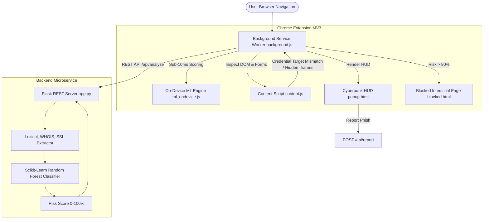

# ⚡ CYBERPUNK PHISH-SHIELD — Advanced Real-Time AI Phishing URL Detector

> **Final Year Engineering Capstone Project**  
> *Production-Grade Browser Defense System powered by Manifest V3 Chrome Extension, Scikit-Learn Random Forest Classifier, Sub-10ms On-Device Heuristic Engine, DOM Auditing, and Cyberpunk HUD UI.*

---

## 📌 Project Overview
**CYBERPUNK PHISH-SHIELD** is an enterprise-grade cybersecurity solution designed to protect users against modern phishing vectors, credential harvesting, zero-day domains, and cross-site form spoofing. Featuring a high-tech Cyberpunk/Neon HUD interface, the system combines real-time client-side sub-10ms probability scoring with a Python Flask machine learning backend microservice.

---

## 🏛️ System Architecture



---

## 🛡️ Core Feature Matrix

| Feature | Component | Description |
| :--- | :--- | :--- |
| **Lexical Address Bar Inspection** | Backend & Client | Audits URL length, subdomains (>3 flagged), `@` tokens, hyphen counts, digit density. |
| **IP Host Mapping** | `ml_ondevice.js` & `app.py` | Detects raw IPv4/IPv6 hosts (e.g. `http://192.168.1.1/login`) bypass attempts. |
| **WHOIS Domain Verification** | `python-whois` | Queries registry creation dates; flags zero-day domains (<30 days old). |
| **SSL/TLS Certificate Audit** | `pyOpenSSL` | Socket connection audit checking certificate validity, expiration, and self-signed certificates. |
| **Credential Form Auditing** | `content.js` | Scans `<form action="...">` tags for cross-domain credential posts disparate from page host. |
| **Hidden Micro-Iframe Detection**| `content.js` | Scans for zero-opacity, `display:none`, or micro-dimension (`<=2px`) exploit frames. |
| **Redirect Chain Tracking** | `background.js` | Intercepts `webNavigation.onBeforeRedirect` to map multi-hop link shorteners. |
| **Dynamic Action Badge** | `background.js` | Updates Extension Badge: 🔴 `ALERT` (>75%), 🟡 `WARN` (40-75%), 🟢 `SAFE` (<40%). |
| **Interstitial Defense Page** | `blocked.html` | Fullscreen cyberpunk screen intercepting navigation on high-risk links with session bypass option. |
| **24-Hour Local Caching** | `chrome.storage.local` | Caches domain analysis results for 24h to reduce duplicate requests and achieve 0ms latency. |

---

## 📂 Project Structure

```
CYBERPUNK-PHISH-SHIELD/
├── backend/
│   ├── app.py                  # Flask REST API server with /api/analyze & /api/report
│   ├── model_trainer.py        # Dataset generator & Scikit-Learn Random Forest trainer
│   ├── requirements.txt        # Python backend dependencies
│   ├── phishing_model.pkl      # Saved Random Forest Classifier model binary
│   └── scaler.pkl              # Saved StandardScaler binary
├── extension/
│   ├── manifest.json           # Chrome Extension Manifest V3 configuration
│   ├── popup/
│   │   ├── popup.html          # Cyberpunk HUD popup interface
│   │   ├── popup.css           # Neon Obsidian visual system & laser scan animation
│   │   └── popup.js            # HUD UI logic & API fetch handler
│   ├── scripts/
│   │   ├── background.js       # Service worker: navigation, badge state, caching & redirect tracking
│   │   ├── content.js          # DOM auditor: credential post targets & hidden iframes
│   │   └── ml_ondevice.js      # On-device sub-10ms heuristic/RF probability classifier
│   └── blocked/
│       ├── blocked.html        # Interstitial Threat Warning Page
│       ├── blocked.css         # Red glitch warning theme
│       └── blocked.js          # Threat diagnostics & session whitelist bypass logic
└── README.md                   # System documentation & presentation guide
```

---

## 🚀 Quick Start Guide

### Step 1: Initialize Python Backend & Train ML Model

```bash
# 1. Navigate to backend directory
cd backend

# 2. Install dependencies
pip install -r requirements.txt

# 3. Train the Scikit-Learn Model (Generates phishing_model.pkl & scaler.pkl)
python model_trainer.py

# 4. Start the Flask REST API Server (runs on http://127.0.0.1:5000)
python app.py
```

### Step 2: Install Chrome Extension (Manifest V3)

1. Open Google Chrome browser and navigate to `chrome://extensions/`.
2. Enable **Developer mode** using the toggle in the top-right corner.
3. Click **Load unpacked**.
4. Select the `extension/` folder inside this project directory (`c:\Users\mohit\OneDrive\Desktop\PRO\extension`).
5. Pin **CYBERPUNK PHISH-SHIELD** to your browser toolbar!

---

## 🧪 Testing & Verification

1. **Safe Domain Verification**:
   - Navigate to `https://google.com` or `https://github.com`.
   - Click Extension icon: HUD displays `[ SYSTEM SECURE ]`, 🟢 Green Badge, Risk ~ 5-15%.
2. **High Threat Phishing Lander**:
   - Open test link or payload: `http://paypal-security-login-update.com/otp` or `http://192.168.1.1/admin`.
   - Result: 🔴 Red Badge `ALERT`, Risk Score > 80%, Browser automatically intercepts and displays `blocked.html` interstitial page.
3. **Crowdsourced Phishing Report**:
   - Open HUD popup, click **REPORT PHISH**. The threat report is logged to backend `/api/report`.

---

## 🎨 Visual Aesthetics & Palette

- **Dark Obsidian Background**: `#080811` / `#0a0a12`
- **Neon Cyan Accent**: `#00f3ff`
- **Neon Pink Danger Highlight**: `#ff0055`
- **Warning Amber**: `#ffb700`
- **Neon Green Safe**: `#00ff88`
- **Typography**: Google Fonts (*Orbitron*, *Share Tech Mono*)
